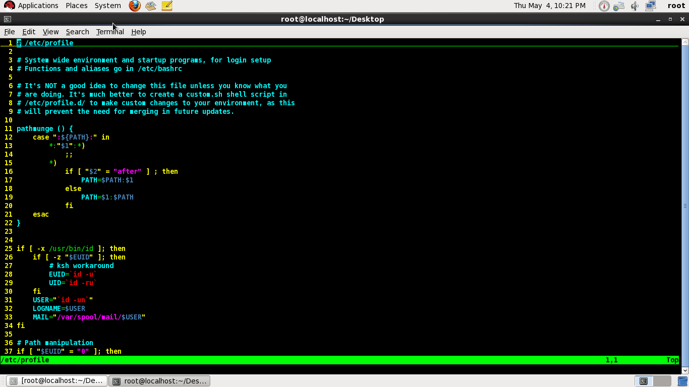
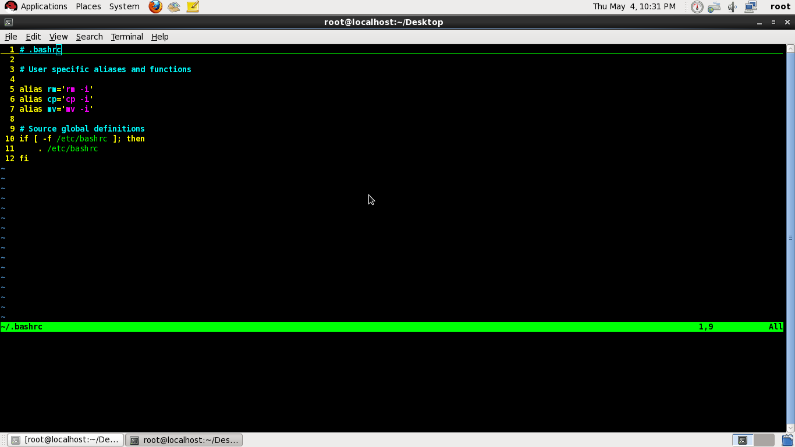

**环境变量**

环境变量是bash shell的特性，用来存储有关shell会话和工作环境的信息。允许在内存中存储数据，以便运行在shell上的程序和脚本访问。这些数据可以是用来识别用户、系统、Shell的特性以及任何其它需要存储的数据。

**变量说明**

PATH这个变量包含了一系列由冒号分隔开的目录，系统就从这些目录寻找可执行文件。如果你输入的可执行文件（如：ls,cd）不在这些目录中，系统就无法执行它，除非你输入这个命令的完整路径，如/bin/ls

**常见的环境变量**

PATH：决定了shell将到那些目录中寻找命令或程序

**查看全局变量可以是用printenv命令。**
**set命令可以显示为某个特定进程设置的环境变量，也包括全局环境变量**

**登录shell**

登录linux系统时，bashshell会作为登录shell启动。登录shell会从4个不同的启动文件里读取命令。下面是bash shell读取这些文件的顺序：

/etc/profile

$HOME/.bash_profile

$HOME/.bash_login

$HOME/.profile

/etc/profile文件是系统上默认的bash shell的主启动文件。系统上的每个用户登录时都会执行这个启动文件。另外3个启动文件是用户专有的，可以根据每个用户的需求具体定制。

在/etc/profile中配置所有用户的，一般不建议在这个里面修改，一般在.bashrc中修改只给当前用户用

在/root/.bashrc中修改只给当前用户用
